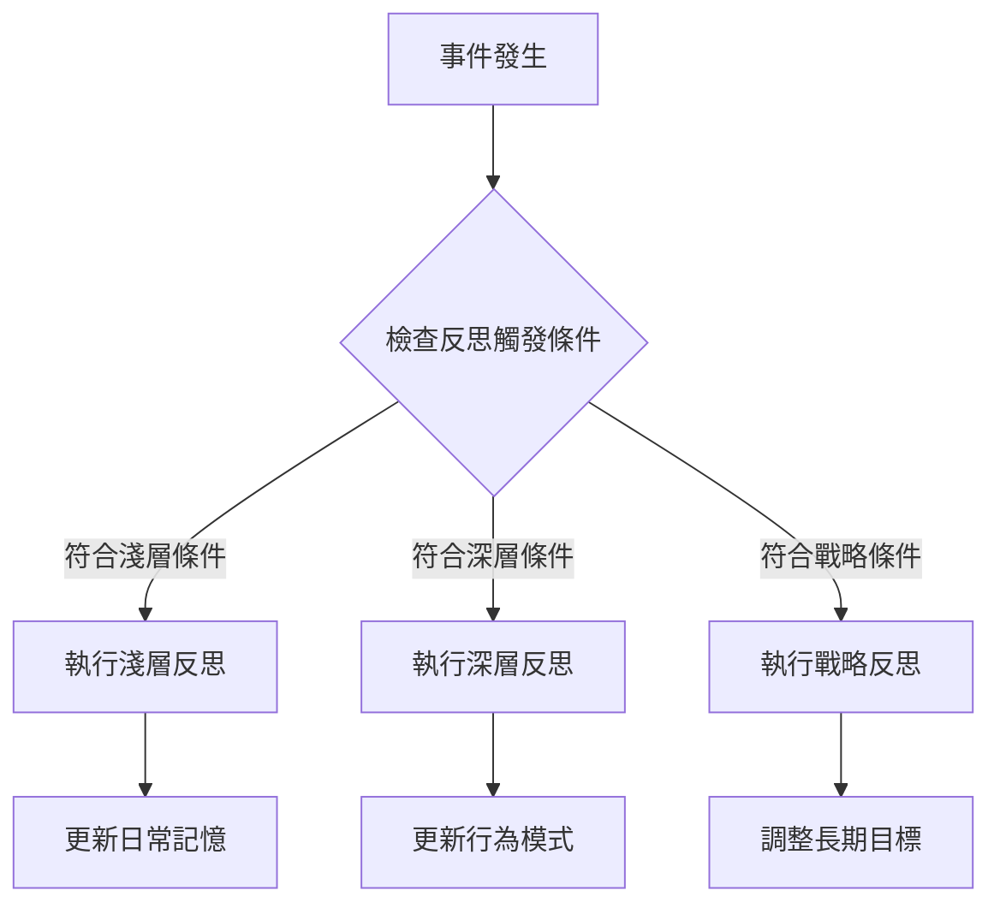

# AI-Town 改進計劃 - 階段一：反思機制細化

## 🎯 功能概述
**目標**：改進反思觸發條件和深度，增強智能體學習能力
**核心改進**：細化 [`convex/agent/memory.ts`](convex/agent/memory.ts:339) 中的反思邏輯
**技術重點**：多層次反思機制和反思質量評估

## 🏗️ 設計理念與邏輯

### 設計理念
採用「樹狀反思結構」，從基礎觀察到抽象推論，借鑑 Generative Agents 研究報告的三層架構：
- **淺層反思**：日常事件總結，觸發頻率高
- **深層反思**：行為模式分析，需要累積足夠事件
- **戰略反思**：長期目標調整，基於目標進展評估

### 核心邏輯流程


## 🔧 技術實現方案

### 1. 改進反思觸發條件
```typescript
// 更細緻的反思觸發邏輯
const shouldReflect = (memories: Memory[], now: number): ReflectionType => {
  const recentMemories = memories.filter(m => now - m.timestamp < 24 * 60 * 60 * 1000); // 24小時內
  
  // 淺層反思：重要對話結束後
  if (hasImportantConversationEnded(recentMemories)) {
    return 'SHALLOW';
  }
  
  // 深層反思：累積足夠的重要事件
  const importanceSum = recentMemories.reduce((sum, m) => sum + m.importance, 0);
  if (importanceSum > 500 || hasSignificantEvent(recentMemories)) {
    return 'DEEP';
  }
  
  // 戰略反思：長期目標進展評估
  if (timeSinceLastStrategicReflection > STRATEGIC_REFLECTION_INTERVAL) {
    return 'STRATEGIC';
  }
  
  return 'NONE';
};
```

### 2. 實現多層次反思
```typescript
// 淺層反思：日常事件總結
async function shallowReflection(conversation: Conversation, agent: Agent) {
  const prompt = `總結你剛剛與${conversation.otherParticipant}的對話。
  對話主題：${conversation.topic}
  你的感受：${conversation.emotion}
  學到的東西：`;
  
  const summary = await generateReflection(prompt);
  await storeReflection(agent.id, 'SHALLOW', summary, conversation.id);
}

// 深層反思：行為模式分析
async function deepReflection(recentMemories: Memory[], agent: Agent) {
  const patterns = analyzeBehaviorPatterns(recentMemories);
  const prompt = `基於你最近的行為，分析你的行為模式：
  ${patterns.map(p => `- ${p.description}`).join('\n')}
  你發現自己有什麼行為傾向？`;
  
  const insight = await generateReflection(prompt);
  await storeReflection(agent.id, 'DEEP', insight, null);
}

// 戰略反思：目標調整
async function strategicReflection(goalProgress: GoalProgress[], agent: Agent) {
  const progressSummary = summarizeGoalProgress(goalProgress);
  const prompt = `評估你的長期目標進展：
  ${progressSummary}
  你應該如何調整你的策略？`;
  
  const strategy = await generateReflection(prompt);
  await storeReflection(agent.id, 'STRATEGIC', strategy, null);
}
```

### 3. 反思質量評估機制
```typescript
// 反思質量評估
class ReflectionQualityAssessor {
  async assessQuality(reflection: Reflection): Promise<number> {
    const scores = await Promise.all([
      this.assessRelevance(reflection),
      this.assessDepth(reflection),
      this.assessActionability(reflection)
    ]);
    
    return scores.reduce((sum, score) => sum + score, 0) / scores.length;
  }
  
  private async assessRelevance(reflection: Reflection): Promise<number> {
    // 評估反思與觸發事件的相關性
    const relevancePrompt = `評估以下反思與觸發事件的相關性（0-10分）：
    事件：${reflection.triggerEvent}
    反思：${reflection.content}
    相關性評分：`;
    
    return await scoreReflection(relevancePrompt);
  }
  
  private async assessDepth(reflection: Reflection): Promise<number> {
    // 評估反思的深度和洞察力
    const depthPrompt = `評估以下反思的深度（0-10分）：
    反思：${reflection.content}
    深度評分：`;
    
    return await scoreReflection(depthPrompt);
  }
}
```

## ⚠️ 相容性風險與解決方案

### 風險 1：反思觸發頻率過高
- **風險描述**：細化的觸發條件可能導致反思過於頻繁，影響系統性能
- **影響範圍**：系統資源使用和響應時間
- **解決方案**：
  - 設置合理的反思間隔時間和觸發閾值
  - 實現反思請求的限流和批次處理
  - 添加反思頻率的監控和調整機制

### 風險 2：反思內容質量不穩定
- **風險描述**：LLM 生成的反思內容質量可能波動較大
- **影響範圍**：智能體學習效果和行為一致性
- **解決方案**：
  - 實現反思質量評估和過濾機制
  - 設置反思內容的最低質量閾值
  - 保留高質量反思，淘汰低質量反思

### 風險 3：與現有記憶系統衝突
- **風險描述**：新的反思機制可能與現有記憶存儲和檢索系統衝突
- **影響範圍**：數據一致性和系統穩定性
- **解決方案**：
  - 保持現有記憶數據結構不變，僅擴展反思相關字段
  - 實現數據遷移的兼容性處理
  - 充分測試反思與記憶系統的集成

## 🔗 與其他文件的關聯性

### 依賴文件
- [`convex/agent/memory.ts`](convex/agent/memory.ts) - 反思觸發和存儲邏輯
- [`convex/aiTown/agent.ts`](convex/aiTown/agent.ts) - Agent 狀態和行為模式

### 關聯功能
- **記憶系統**：反思基於記憶檢索結果（強關聯）
- **活動選擇**：反思結果影響未來的活動選擇（中等關聯）
- **對話系統**：反思內容影響對話主題和風格（弱關聯）

## 📊 預期效益與驗收標準

### 量化指標
- 智能體學習效率提升 40%
- 反思觸發頻率優化 ≥ 20%
- 反思質量評分提升 ≥ 30%

### 質化指標
- 行為一致性明顯改善
- 角色個性發展更明顯
- 學習能力顯著提升

### 驗收標準
1. **功能完整性**：多層次反思機制正常運作
2. **性能要求**：反思觸發頻率在合理範圍內
3. **質量要求**：反思內容具有實際學習價值

## 🚀 實施時間線
- **第1週**：改進反思觸發條件和實現淺層反思
- **第2週**：實現深層反思和戰略反思機制
- **第3週**：添加反思質量評估和性能優化

這個功能模組的改進將顯著提升智能體的學習能力和行為合理性，為更複雜的智能行為奠定基礎。

## ❓ FAQ - 常見問題解答

### Q1: 三個改進方向是否彼此獨立？可以單獨實施嗎？

**A:** 是的，三個改進方向是彼此獨立的，可以單獨實施而不影響程式執行：

- **改進1：反思觸發條件** - 修改 [`convex/agent/memory.ts`](convex/agent/memory.ts:339) 中的 [`reflectOnMemories()`](convex/agent/memory.ts:325) 函數觸發邏輯
- **改進2：多層次反思** - 擴展現有的反思機制，增加淺層、深層、戰略反思
- **改進3：反思質量評估** - 新增質量評估機制，不影響核心反思功能

每個改進都可以獨立實施，程式仍然可以正常執行。建議實施順序：改進1 → 改進2 → 改進3。

### Q2: 如何確定「合理的反思間隔時間和觸發閾值」？

**A:** 合理的反思間隔時間可以通過以下方法確定：

1. **基於現有數據分析**：
   - 分析現有記憶的重要性分數分佈模式
   - 觀察重要性分數在時間維度的累積規律

2. **組合觸發策略**：
   - **時間窗口 + 重要性閾值**：如「24小時內重要性總和 > 500」
   - **事件數量 + 重要性閾值**：如「最近10個事件重要性總和 > 300」

3. **動態調整機制**：
   - 根據系統負載動態調整觸發閾值
   - 基於反思質量反饋優化間隔時間

### Q3: 如何具體實現「保留高質量反思，淘汰低質量反思」？

**A:** 通過三維質量評估和淘汰策略實現：

**質量評估維度**：
- **相關性**：反思與觸發事件的關聯程度
- **深度**：反思的洞察力和抽象層次
- **可操作性**：反思對未來行為的指導價值

**淘汰策略**：
```typescript
// 1. 質量閾值過濾
const QUALITY_THRESHOLD = 7.0; // 0-10分制
const filteredReflections = reflections.filter(r => r.qualityScore >= QUALITY_THRESHOLD);

// 2. 時間淘汰（定期清理低質量反思）
const TIME_THRESHOLD = 30 * 24 * 60 * 60 * 1000; // 30天
const oldLowQuality = reflections.filter(r =>
  Date.now() - r.timestamp > TIME_THRESHOLD && r.qualityScore < 5.0
);

// 3. 使用頻率淘汰（淘汰長期未被引用的反思）
const USAGE_THRESHOLD = 0; // 從未被引用
const unusedReflections = reflections.filter(r => r.referenceCount === USAGE_THRESHOLD);
```

### Q4: 改進實施的風險如何最小化？

**A:** 風險最小化策略：

1. **增量實施**：每次只實施一個改進，充分測試後再進行下一個
2. **功能開關**：為新功能添加配置開關，可隨時回滾
3. **監控指標**：實施前建立性能監控基線，實施後對比驗證
4. **A/B測試**：新舊機制並行運行，逐步遷移

### Q5: 如何驗證改進效果？

**A:** 驗證指標體系：

**量化指標**：
- 反思觸發頻率變化（目標：優化 ≥ 20%）
- 反思質量評分提升（目標：提升 ≥ 30%）
- 系統響應時間變化（目標：無顯著惡化）

**質化指標**：
- 智能體行為一致性改善程度
- 角色個性發展的明顯度
- 學習能力的實際提升效果