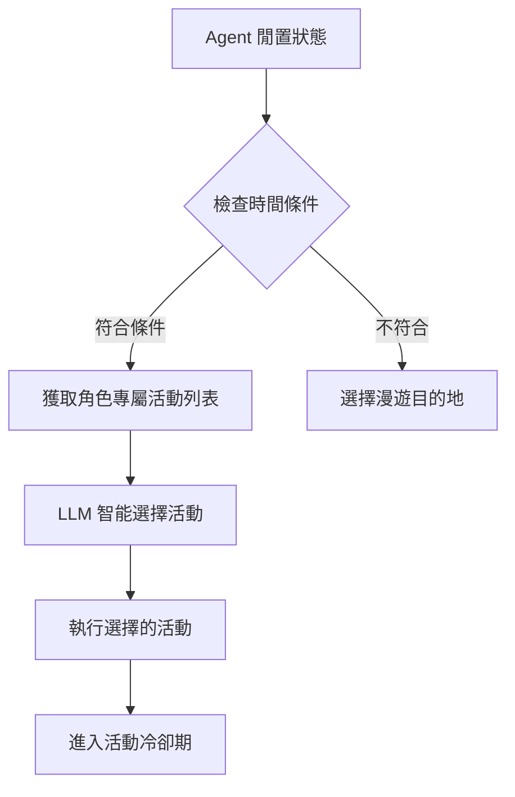

# AI-Town 改進計劃 - 階段一：活動選擇智能化

## 🎯 功能概述
**目標**：將隨機活動選擇改為 LLM 驅動的智能選擇，提升行為合理性
**核心改進**：完成 [`convex/aiTown/agentOperations.ts`](convex/aiTown/agentOperations.ts:128) 中的 TODO 標記
**技術重點**：基於角色設定和當前情境的活動選擇邏輯

## 🏗️ 設計理念與邏輯

### 設計理念
採用「有限選擇+LLM優化」的混合策略，平衡創意性與可控性：
- **預定義活動**：確保行為在合理範圍內，便於調試和分析
- **LLM 智能選擇**：基於角色個性和當前情境進行個性化選擇
- **漸進式改進**：先實現基於預定義活動的選擇，後續引入生成能力

### 核心邏輯流程


## 🚀 MVP 設計方案 (優先實作)

### 設計原則
採用**最小可行方案 (MVP)** 策略,先建立完整的技術架構,驗證可行性後再逐步擴展:
- **範圍限定**: 先實作單一角色 (Lucky),建立完整流程
- **簡化策略**: 簡單的錯誤降級,暫不實作複雜的快取機制
- **情境最小化**: 只使用基本的 identity + plan,避免過度複雜
- **格式標準化**: 使用 JSON 格式回應,確保解析穩定
- **漸進驗證**: 每個階段都有明確的驗證標準

### MVP 實作範圍

#### 第一階段:單角色智能選擇 (Week 1)
1. **為 Lucky 定義專屬活動** (6-8 個活動)
2. **實作基礎的 LLM 選擇邏輯**
   - 簡單的 prompt 設計
   - JSON 格式回應要求
   - 基本的錯誤處理 (失敗時回退到隨機選擇)
3. **整合到現有流程**
   - 替換 [agentOperations.ts:128](convex/aiTown/agentOperations.ts#L128) 的 TODO
   - 保持原有時間控制邏輯不變

#### 第二階段:多角色擴展 (Week 2)
1. **為其他角色定義專屬活動**
   - Bob (grumpy gardener): 園藝相關活動
   - Stella (charming trickster): 社交操縱相關活動
   - Alice (brilliant scientist): 科學研究相關活動
2. **通用活動系統**
   - 定義所有角色都可選擇的通用活動
   - 角色專屬活動與通用活動的合併邏輯

#### 第三階段:驗證與優化 (Week 3)
1. **行為觀察與記錄**
   - 添加活動選擇的日誌記錄
   - 觀察各角色的活動分布
2. **效果評估**
   - 人工評估角色行為合理性
   - 檢查是否有異常的選擇模式
3. **性能優化** (可選)
   - 如果 LLM 呼叫成為瓶頸,考慮添加簡單快取

### MVP 技術決策

#### 1. LLM 策略:簡單降級
```typescript
// 錯誤處理策略
async function chooseActivityWithFallback(ctx, player, agent) {
  try {
    return await chooseActivityWithLLM(ctx, player, agent);
  } catch (error) {
    console.error('LLM activity selection failed, falling back to random:', error);
    // 降級到隨機選擇
    return selectRandomActivity(agent.name);
  }
}
```

#### 2. 情境資訊:最小化
```typescript
// 只使用最基本的情境資訊
const prompt = `你是 ${agent.identity}
你的目標: ${agent.plan}

請從以下活動中選擇一個最適合你的:
${availableActivities.map((a, i) => `${i + 1}. ${a.description}`).join('\n')}

請用 JSON 格式回應,只包含活動編號:
{"activityIndex": 數字}`;
```

#### 3. 回應格式:嚴格的 JSON
```typescript
// 使用 response_format 確保 JSON 輸出
const { content } = await chatCompletion({
  messages: [{ role: 'user', content: prompt }],
  response_format: { type: 'json_object' },
  temperature: 0.7,
});

// 解析回應
const parsed = JSON.parse(content);
const index = parsed.activityIndex - 1; // 轉換為 0-based index

// 驗證索引有效性
if (index < 0 || index >= availableActivities.length) {
  throw new Error('Invalid activity index');
}
```

#### 4. 測試方式:人工觀察 + 日誌
```typescript
// 添加選擇記錄
console.log(`[Activity Selection] ${agent.name} chose "${activity.description}" (${activity.emoji})`);
console.log(`  - Available options: ${availableActivities.length}`);
console.log(`  - LLM response time: ${ms}ms, retries: ${retries}`);
```

### MVP 與完整方案的差異

| 功能 | MVP 方案 | 完整方案 (未來) |
|------|---------|----------------|
| **角色範圍** | Lucky → 所有角色 | 所有角色 + 動態角色 |
| **活動數量** | 6-8 個/角色 | 10-15 個/角色 |
| **情境資訊** | identity + plan | + 位置 + 歷史 + 時間 |
| **快取策略** | 無 (僅錯誤降級) | 智能快取 + 預生成 |
| **回應格式** | JSON (activityIndex) | JSON (包含選擇理由) |
| **監控** | Console log | 完整的 metrics 系統 |

---

## ❓ 待釐清問題與決策記錄

### 已決策問題

#### Q1: LLM 呼叫策略的具體實作細節
**問題描述**: 原文件提到「快取機制」和「降級方案」,但沒有明確說明實作細節。

**MVP 決策**:
- ✅ **快取策略**: MVP 階段**不實作快取**,每次都呼叫 LLM
  - 理由: 簡化實作,先驗證基本可行性
  - 未來考慮: 若 LLM 成本/延遲成為瓶頸,再添加快取
- ✅ **降級方案**: 採用**簡單的錯誤降級**
  - 觸發條件: LLM 呼叫失敗 (timeout、API error、解析失敗)
  - 降級行為: 回退到原有的隨機選擇邏輯
  - 日誌記錄: 記錄所有降級事件,便於後續分析

#### Q2: 活動選擇的「情境資訊」範圍
**問題描述**: 原設計只包含 `identity` 和 `plan`,是否需要更多情境資訊?

**MVP 決策**:
- ✅ **最小化情境**: 只使用 `identity` + `plan`
  - 理由: 避免 prompt 過長,降低 LLM 成本和複雜度
  - 未來擴展: 驗證基本方案後,可以逐步添加:
    - 當前所在位置 (如: 在圖書館 → 更可能選擇閱讀)
    - 最近的活動歷史 (避免重複選擇)
    - 時間資訊 (早/午/晚可能影響活動選擇)

#### Q3: 角色活動定義的完整性
**問題描述**: 是否需要為所有角色定義專屬活動?

**MVP 決策**:
- ✅ **分階段實作**:
  - **Week 1**: 只實作 Lucky 的專屬活動 (6-8 個)
  - **Week 2**: 擴展到所有現有角色 (Bob, Stella, Alice)
  - 每個角色: 6-8 個專屬活動 + 5 個通用活動
- ✅ **通用活動系統**: 定義所有角色都可以選擇的基礎活動
  - reading, daydreaming, walking, observing, resting

#### Q4: LLM 回應解析的錯誤處理
**問題描述**: 如何處理 LLM 回應格式錯誤或無效的活動選擇?

**MVP 決策**:
- ✅ **強制 JSON 格式**: 使用 `response_format: { type: 'json_object' }`
  - Ollama 支援性: 需要驗證當前使用的 `gpt-oss:20b-cloud` 是否支援
  - 備選方案: 如果不支援,使用字串解析 + 正則表達式
- ✅ **嚴格的驗證邏輯**:
  ```typescript
  1. 解析 JSON
  2. 驗證 activityIndex 欄位存在
  3. 驗證索引在有效範圍內 [0, activities.length)
  4. 任何步驟失敗 → 拋出錯誤 → 觸發降級
  ```

#### Q5: 測試與驗證方式
**問題描述**: 如何量測「活動選擇合理性提升 30%」?

**MVP 決策**:
- ✅ **主要依靠人工觀察**:
  - 運行系統 30-60 分鐘
  - 觀察每個角色的活動選擇
  - 主觀評估是否符合角色設定
- ✅ **輔助數據記錄**:
  - 記錄每次活動選擇的詳細 log
  - 統計每個活動被選擇的頻率
  - 記錄 LLM 呼叫的性能數據 (延遲、重試次數)
- ⏸️ **量化評估**: 暫不實作自動化評分,未來可考慮:
  - 使用另一個 LLM 評估選擇的合理性
  - 基於規則的評分系統

#### Q6: 與現有 LLM 整合
**問題描述**: 現有的 LLM 設定是否支援本功能?

**已確認**:
- ✅ **當前配置**: 使用 Ollama 本地部署,模型為 `gpt-oss:20b-cloud`
- ✅ **chatCompletion 函數**: 已存在且功能完整
  - 支援 `response_format` 參數 (需驗證 Ollama 模型支援度)
  - 內建重試機制 (最多 3 次,指數退避)
  - 自動處理 timeout 和 API 錯誤
- ⚠️ **需要驗證**:
  - Ollama 的 `gpt-oss:20b-cloud` 是否支援 JSON mode
  - 如果不支援,需要調整解析策略為字串 parsing

### 待討論問題

#### Q7: 活動持續時間是否需要動態調整?
**問題描述**: 現有活動都是固定 60 秒,是否需要根據活動類型調整?

**選項**:
- A. 保持 60 秒不變 (與現有 ACTIVITY_COOLDOWN 兼容)
- B. 不同活動不同時間 (30-120 秒)
- C. 讓 LLM 決定持續時間

**建議**: 選項 A (保持簡單,避免引入時間控制的複雜性)

#### Q8: 是否需要記憶系統整合?
**問題描述**: 活動選擇是否應該參考角色的記憶?

**選項**:
- A. MVP 階段不整合,只用基本的 identity + plan
- B. 讀取最近的記憶作為情境

**建議**: 選項 A (MVP 保持簡單,記憶整合留待後續階段)

---

## 🔧 技術實現方案 (完整版)

### 1. 擴展活動定義系統
```typescript
// 在 constants.ts 中擴展角色專屬活動
export const CHARACTER_SPECIFIC_ACTIVITIES = {
  // Lucky - 快樂好奇的太空探險家
  'Lucky': [
    { description: 'reading about space exploration', emoji: '🚀', duration: 60_000, category: 'intellectual' },
    { description: 'telling space adventure stories', emoji: '✨', duration: 60_000, category: 'social' },
    { description: 'observing squirrels', emoji: '🐿️', duration: 60_000, category: 'observational' },
    { description: 'studying science history', emoji: '📚', duration: 60_000, category: 'intellectual' },
    { description: 'exploring new areas', emoji: '🗺️', duration: 60_000, category: 'adventurous' },
    { description: 'cheese tasting', emoji: '🧀', duration: 60_000, category: 'culinary' }
  ],
  // 其他角色定義...
};

// 通用活動（所有角色都可以選擇）
export const COMMON_ACTIVITIES = [
  { description: 'reading a book', emoji: '📖', duration: 60_000, category: 'intellectual' },
  { description: 'daydreaming', emoji: '🤔', duration: 60_000, category: 'reflective' },
  { description: 'taking a walk', emoji: '🚶', duration: 60_000, category: 'physical' },
  { description: 'observing surroundings', emoji: '👀', duration: 60_000, category: 'observational' },
  { description: 'resting', emoji: '😴', duration: 60_000, category: 'restorative' }
];
```

### 2. LLM 驅動的活動選擇邏輯 (MVP 實作版本)

#### 2.1 核心選擇函數
```typescript
// 在 convex/aiTown/agentOperations.ts 中實現
import { chatCompletion } from '../util/llm';
import { getAvailableActivities, ACTIVITIES, ActivityDefinition } from '../constants';

/**
 * 使用 LLM 選擇活動 (帶降級處理)
 */
async function chooseActivityWithLLM(
  ctx: ActionCtx,
  agent: SerializedAgent
): Promise<ActivityDefinition> {
  try {
    const availableActivities = getAvailableActivities(agent.name);

    // 構建活動選項列表
    const activityList = availableActivities
      .map((a, i) => `${i + 1}. ${a.description} ${a.emoji}`)
      .join('\n');

    // 構建 prompt (使用簡化的情境資訊)
    const prompt = `你是 ${agent.identity}

你的目標: ${agent.plan}

請從以下活動中選擇一個最適合你當前狀態的活動:
${activityList}

請只用 JSON 格式回應,包含活動編號 (1-${availableActivities.length}):
{"activityIndex": 數字}`;

    // 呼叫 LLM
    const { content, retries, ms } = await chatCompletion({
      messages: [{ role: 'user', content: prompt }],
      response_format: { type: 'json_object' },
      temperature: 0.7,
      max_tokens: 50,
    });

    // 解析並驗證回應
    const parsed = JSON.parse(content);
    const activityIndex = parsed.activityIndex - 1;

    if (
      typeof activityIndex !== 'number' ||
      activityIndex < 0 ||
      activityIndex >= availableActivities.length
    ) {
      throw new Error(`Invalid activity index: ${activityIndex}`);
    }

    const selected = availableActivities[activityIndex];

    // 記錄選擇 (用於觀察和調試)
    console.log(`[Activity Selection] ${agent.name} chose "${selected.description}" ${selected.emoji}`);
    console.log(`  - LLM response: ${ms}ms, retries: ${retries}`);
    console.log(`  - Options: ${availableActivities.length}`);

    return selected;

  } catch (error) {
    // 降級到隨機選擇
    console.error(`[Activity Selection] LLM failed for ${agent.name}, falling back to random:`, error);
    return selectRandomActivity(agent.name);
  }
}

/**
 * 降級方案: 隨機選擇活動
 */
function selectRandomActivity(characterName: string): ActivityDefinition {
  const availableActivities = getAvailableActivities(characterName);

  if (availableActivities.length === 0) {
    // 如果沒有定義活動,使用原有的 ACTIVITIES
    return ACTIVITIES[Math.floor(Math.random() * ACTIVITIES.length)];
  }

  const selected = availableActivities[Math.floor(Math.random() * availableActivities.length)];
  console.log(`[Activity Selection] ${characterName} randomly chose "${selected.description}"`);
  return selected;
}
```

#### 2.2 在 constants.ts 中添加輔助函數
```typescript
// convex/constants.ts

export interface ActivityDefinition {
  description: string;
  emoji: string;
  duration: number;
  category?: string;
}

// Lucky 的專屬活動 (MVP Week 1)
export const LUCKY_ACTIVITIES: ActivityDefinition[] = [
  { description: 'reading about space exploration', emoji: '🚀', duration: 60_000, category: 'intellectual' },
  { description: 'telling space adventure stories', emoji: '✨', duration: 60_000, category: 'social' },
  { description: 'observing squirrels', emoji: '🐿️', duration: 60_000, category: 'observational' },
  { description: 'studying science history', emoji: '📚', duration: 60_000, category: 'intellectual' },
  { description: 'cheese tasting', emoji: '🧀', duration: 60_000, category: 'culinary' },
  { description: 'stargazing', emoji: '🌟', duration: 60_000, category: 'observational' },
];

// 通用活動 (所有角色)
export const COMMON_ACTIVITIES: ActivityDefinition[] = [
  { description: 'reading a book', emoji: '📖', duration: 60_000, category: 'intellectual' },
  { description: 'daydreaming', emoji: '🤔', duration: 60_000, category: 'reflective' },
  { description: 'taking a walk', emoji: '🚶', duration: 60_000, category: 'physical' },
  { description: 'observing surroundings', emoji: '👀', duration: 60_000, category: 'observational' },
  { description: 'resting', emoji: '😴', duration: 60_000, category: 'restorative' },
];

// 角色活動映射
const CHARACTER_ACTIVITIES_MAP = new Map<string, ActivityDefinition[]>([
  ['Lucky', LUCKY_ACTIVITIES],
  // Week 2 將添加: Bob, Stella, Alice
]);

/**
 * 獲取角色可用的活動列表 (專屬 + 通用)
 */
export function getAvailableActivities(characterName: string): ActivityDefinition[] {
  const characterActivities = CHARACTER_ACTIVITIES_MAP.get(characterName) || [];
  return [...characterActivities, ...COMMON_ACTIVITIES];
}
```

### 3. 整合到現有流程
```typescript
// 修改 convex/aiTown/agentOperations.ts 中的 agentDoSomething
// 替換第 128-143 行的 TODO 部分

export const agentDoSomething = internalAction({
  // ... 參數定義保持不變 ...

  handler: async (ctx, args) => {
    // ... 前面的邏輯保持不變 ...

    if (!player.pathfinding) {
      const recentActivity = /* ... 現有邏輯 ... */;
      const justLeftConversation = /* ... 現有邏輯 ... */;

      if (recentActivity || justLeftConversation) {
        // 選擇漫遊目的地 (保持原邏輯)
        await ctx.runMutation(api.aiTown.main.sendInput, {
          worldId: args.worldId,
          name: 'finishDoSomething',
          args: {
            operationId: args.operationId,
            agentId: agent.id,
            destination: wanderDestination(map),
          },
        });
        return;
      } else {
        // ✨ 新邏輯: LLM 驅動的活動選擇
        const activity = await chooseActivityWithLLM(ctx, agent);

        // 隨機延遲避免 OCC 錯誤
        await sleep(Math.random() * 1000);

        await ctx.runMutation(api.aiTown.main.sendInput, {
          worldId: args.worldId,
          name: 'finishDoSomething',
          args: {
            operationId: args.operationId,
            agentId: agent.id,
            activity: {
              description: activity.description,
              emoji: activity.emoji,
              until: Date.now() + activity.duration,
            },
          },
        });
        return;
      }
    }

    // ... 後續邏輯保持不變 ...
  },
});
```

## ⚠️ 相容性風險與解決方案

### 風險 1：LLM 呼叫頻率增加
- **風險描述**：活動選擇每次都需要呼叫 LLM，可能導致 API 成本上升和響應變慢
- **影響範圍**：系統性能和成本控制
- **解決方案**：
  - 實現活動選擇結果的快取機制（相同情境下重複使用選擇）
  - 添加 LLM 呼叫限流和批次處理
  - 實現降級方案：LLM 失敗時回退到隨機選擇

### 風險 2：活動持續時間衝突
- **風險描述**：新活動的持續時間可能與現有時間控制機制衝突
- **影響範圍**：活動流程和冷卻機制
- **解決方案**：
  - 保持所有活動持續時間為 60 秒，與現有 [`ACTIVITY_COOLDOWN`](convex/constants.ts:25) 兼容
  - 嚴格測試活動切換的時間邊界條件
  - 保留原有的時間檢查邏輯不變

### 風險 3：角色活動定義擴展
- **風險描述**：擴展活動定義可能影響現有角色系統
- **影響範圍**：角色設定和數據結構
- **解決方案**：
  - 保持向後兼容，原有角色使用默認活動列表
  - 新活動定義作為擴展，不修改核心數據結構
  - 實現活動定義的動態載入機制

## 🔗 與其他文件的關聯性

### 依賴文件
- [`convex/constants.ts`](convex/constants.ts) - 活動定義和時間常數
- [`convex/aiTown/agentOperations.ts`](convex/aiTown/agentOperations.ts) - 核心實現邏輯
- [`convex/aiTown/agent.ts`](convex/aiTown/agent.ts) - Agent 狀態機和時間控制

### 關聯功能
- **記憶系統**：活動選擇可能基於過往經驗（弱關聯）
- **反思機制**：活動經驗可能觸發反思（弱關聯）
- **對話系統**：活動選擇影響對話發起時機（中等關聯）

## 📊 預期效益與驗收標準

### 量化指標
- 活動選擇合理性評分提升 ≥ 30%
- 行為多樣性提升 200% 以上（從3種通用活動擴展到11種個性化活動）
- 系統響應時間增加控制在 20% 以內

### 質化指標
- 角色個性表現更明顯，用戶體驗顯著改善
- 活動選擇更符合角色設定和當前情境
- 無回歸問題出現，現有功能正常運作

### 驗收標準
1. **功能完整性**：所有 TODO 標記已完成，新功能無重大 bug
2. **性能要求**：LLM 呼叫頻率在可控範圍內，響應時間無明顯下降
3. **兼容性**：向下兼容性確保，現有活動流程不受影響

## 🚀 實施時間線
- **第1週**：擴展活動定義系統
- **第2週**：實現 LLM 活動選擇邏輯
- **第3週**：整合測試和性能優化

這個功能模組的設計確保了與現有系統的高度兼容性，同時為後續更複雜的活動生成功能奠定了基礎。