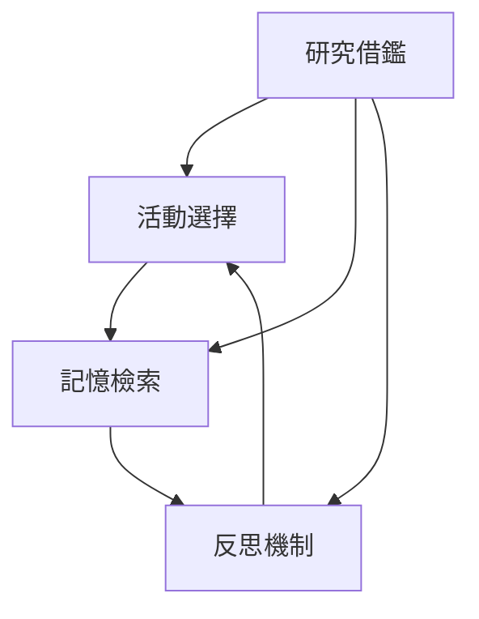

# AI-Town 改進計劃 - 階段一：基礎優化總覽

## 📋 階段概述
**目標**：優化現有核心功能，提升系統穩定性和智能體行為質量
**時間估計**：2-4週
**優先級**：高（對現有系統影響最小，效益最明顯）

## 🎯 功能模組摘要

### 1. 活動選擇智能化
**目標**：將隨機活動選擇改為 LLM 驅動的智能選擇
- **核心改進**：基於角色設定和情境的個性化活動選擇
- **技術重點**：預定義活動 + LLM 智能選擇的混合策略
- **預期效益**：行為多樣性提升 200%，角色個性更明顯

**相關文件**：[活動選擇智能化詳情](AI-Town_改進計劃_階段一_基礎優化_活動選擇.md)

### 2. 記憶檢索優化
**目標**：改進記憶檢索策略，提升對話和決策的上下文相關性
- **核心改進**：多維度加權排序算法（相關性 0.5 + 重要性 0.3 + 時效性 0.2）
- **技術重點**：上下文感知檢索和性能優化
- **預期效益**：記憶相關性提升 30%，對話連貫性改善

**相關文件**：[記憶檢索優化詳情](AI-Town_改進計劃_階段一_基礎優化_記憶系統.md)

### 3. 反思機制細化
**目標**：改進反思觸發條件和深度，增強智能體學習能力
- **核心改進**：多層次反思樹（淺層 → 深層 → 戰略）
- **技術重點**：反思質量評估和觸發條件優化
- **預期效益**：學習效率提升 40%，行為一致性改善

**相關文件**：[反思機制細化詳情](AI-Town_改進計劃_階段一_基礎優化_反思機制.md)

## 🔄 模組間關聯性分析

### 功能依賴關係


### 數據流關係
1. **活動選擇** → 產生新的經驗和記憶
2. **記憶檢索** → 為反思提供素材和上下文
3. **反思機制** → 影響未來的活動選擇決策
4. **研究借鑑** → 為所有模組提供理論基礎

### 時間協調關係
- **並行開發**：三個功能模組可以獨立開發
- **集成順序**：建議按「記憶檢索 → 反思機制 → 活動選擇」順序集成
- **測試策略**：每個模組獨立測試後再進行集成測試

## ⚠️ 全局相容性風險與對策

### 系統級風險
| 風險類型 | 影響範圍 | 對策 |
|---------|---------|------|
| LLM 呼叫頻率增加 | 系統性能和成本 | 實現請求合併、快取和限流機制 |
| 數據結構變更 | 系統穩定性 | 保持向後兼容，不修改核心數據結構 |
| 性能影響 | 用戶體驗 | 添加性能監控和優化機制 |

### 集成風險
| 集成點 | 風險描述 | 對策 |
|--------|----------|------|
| 活動選擇與記憶系統 | 活動選擇依賴記憶檢索結果 | 實現降級機制，記憶系統故障時使用默認選擇 |
| 反思機制與記憶系統 | 反思觸發依賴記憶檢索 | 設置反思觸發的容錯閾值 |
| 各模組時間協調 | 模組間時間依賴可能衝突 | 實現時間戳同步和衝突解決機制 |

## 📊 全局成功指標

### 量化指標
| 指標 | 目標值 | 測量方法 |
|------|--------|----------|
| 活動選擇合理性評分 | 提升 ≥ 30% | 用戶評分對比 |
| 記憶檢索相關性 | 提升 ≥ 25% | 對話連貫性分析 |
| 反思觸發頻率 | 優化 ≥ 20% | 系統日誌分析 |
| 系統響應時間 | 增加 ≤ 20% | 性能監控工具 |

### 質化指標
- 用戶反饋中「行為自然度」評分提升
- 對話連貫性明顯改善
- 系統穩定性維持或提升

## 🛠️ 技術架構整合

### 核心組件關係
```
Agent 狀態機
├── 活動選擇模組 (agentDoSomething)
├── 記憶檢索模組 (rankAndTouchMemories)
├── 反思觸發模組 (shouldReflect)
└── 研究借鑑基礎 (理論指導)
```

### 數據流整合
1. **輸入**：Agent 當前狀態、環境上下文
2. **處理**：各模組按順序處理，共享上下文信息
3. **輸出**：優化後的決策和行為

## 🔄 實施路線圖

### 第一週：基礎準備
- [ ] 活動選擇：擴展活動定義系統
- [ ] 記憶系統：改進排序算法
- [ ] 反思機制：改進觸發條件
- [ ] 研究借鑑：完成理論分析

### 第二週：核心實現
- [ ] 活動選擇：實現 LLM 驅動選擇
- [ ] 記憶系統：實現上下文感知檢索
- [ ] 反思機制：實現多層次反思
- [ ] 集成測試：模組間接口測試

### 第三週：集成優化
- [ ] 性能優化：快取和限流機制
- [ ] 質量保證：全面測試和 bug 修復
- [ ] 文檔更新：技術文檔和用戶指南

### 第四週：上線準備
- [ ] 監控部署：性能監控和日誌系統
- [ ] 用戶反饋：收集早期用戶反饋
- [ ] 迭代優化：基於反響進行微調

## 📈 風險管理計劃

### 高風險項目
1. **LLM 成本控制**
   - 監控：實時 API 使用監控
   - 限流：設置請求頻率限制
   - 降級：LLM 故障時回退本地邏輯

2. **系統性能**
   - 基準測試：上線前性能基準
   - 監控告警：設置性能閾值告警
   - 擴容計劃：預備資源擴容方案

3. **用戶體驗**
   - A/B 測試：新舊版本對比
   - 用戶反饋：快速響應機制
   - 回滾計劃：緊急情況回滾流程

## 🔗 與後續階段的銜接

### 階段二準備
- 本階段為角色個性化奠定基礎
- 記憶系統優化為複雜對話提供支持
- 反思機制為長期學習建立框架

### 技術債務管理
- 保持代碼的可擴展性和可維護性
- 文檔及時更新，便於後續開發
- 建立持續集成和測試流程

## 📋 驗收標準清單

### 功能完整性
- [ ] 所有 TODO 標記已完成
- [ ] 新功能無重大 bug
- [ ] 向下兼容性確保

### 性能要求
- [ ] 系統響應時間無明顯下降
- [ ] LLM 呼叫頻率在可控範圍內
- [ ] 記憶使用效率提升

### 用戶體驗
- [ ] 智能體行為明顯更自然
- [ ] 對話質量提升可感知
- [ ] 無回歸問題出現

這個總覽文件提供了階段一改進的全局視圖，確保各個功能模組協調一致，風險可控，目標明確。