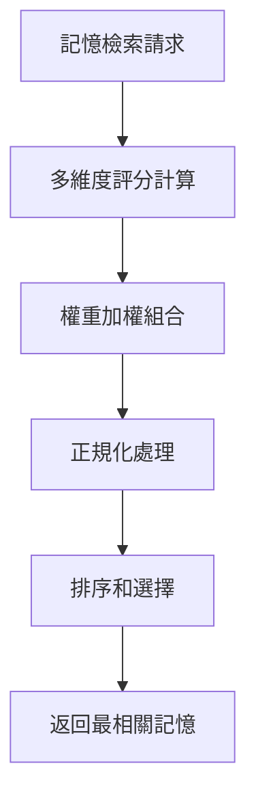

# AI-Town 改進計劃 - 階段一：記憶檢索優化

## 🎯 功能概述
**目標**：改進記憶檢索策略，提升對話和決策的上下文相關性
**核心改進**：優化 [`convex/agent/memory.ts`](convex/agent/memory.ts:203) 中的記憶排序算法
**技術重點**：多維度檢索策略和上下文感知檢索

## 🏗️ 設計理念與邏輯

### 設計理念
基於「相關性+重要性+時效性」的多維度加權模型，借鑑 Generative Agents 研究報告的驗證架構：
- **相關性優先**：確保記憶與當前情境最相關（權重 0.5）
- **重要性平衡**：重要記憶應該更頻繁地被回憶（權重 0.3）
- **時效性考量**：近期記憶對當前決策更有參考價值（權重 0.2）

### 核心邏輯流程


## 🔧 技術實現方案

### 1. 改進排序算法
```typescript
// 在 rankAndTouchMemories 中改進排序邏輯
const memoryScores = relatedMemories.map((memory, idx) => {
  // 計算各個維度的分數
  const relevanceScore = normalize(args.candidates[idx]._score, relevanceRange) * 0.5;
  const importanceScore = normalize(memory.importance, importanceRange) * 0.3;
  const recencyScore = normalize(calculateRecencyScore(memory.timestamp), recencyRange) * 0.2;
  
  return {
    memory,
    overallScore: relevanceScore + importanceScore + recencyScore
  };
});

// 按總分排序並選擇前 N 個
const topMemories = memoryScores
  .sort((a, b) => b.overallScore - a.overallScore)
  .slice(0, NUM_MEMORIES_TO_SEARCH)
  .map(item => item.memory);
```

### 2. 實現上下文感知檢索
```typescript
// 上下文感知的記憶檢索
async function getContextAwareMemories(
  ctx: ActionCtx, 
  agentId: GameId<'agents'>, 
  currentContext: SearchContext
) {
  const baseMemories = await getRelatedMemories(ctx, agentId, currentContext.query);
  
  // 根據當前情境調整權重
  const contextWeights = calculateContextWeights(currentContext);
  const scoredMemories = baseMemories.map(memory => ({
    memory,
    score: calculateContextualScore(memory, currentContext, contextWeights)
  }));
  
  return scoredMemories.sort((a, b) => b.score - a.score).slice(0, NUM_MEMORIES_TO_SEARCH);
}
```

### 3. 性能優化機制
```typescript
// 記憶檢索快取機制
class MemoryCache {
  private cache = new Map<string, { memories: any[], timestamp: number }>();
  private readonly CACHE_TTL = 5 * 60 * 1000; // 5分鐘
  
  async getCachedMemories(agentId: string, contextHash: string) {
    const cacheKey = `${agentId}:${contextHash}`;
    const cached = this.cache.get(cacheKey);
    
    if (cached && Date.now() - cached.timestamp < this.CACHE_TTL) {
      return cached.memories;
    }
    return null;
  }
  
  setCachedMemories(agentId: string, contextHash: string, memories: any[]) {
    const cacheKey = `${agentId}:${contextHash}`;
    this.cache.set(cacheKey, { memories, timestamp: Date.now() });
  }
}
```

## ⚠️ 相容性風險與解決方案

### 風險 1：排序算法變更影響現有對話
- **風險描述**：新的排序算法可能改變記憶檢索結果，影響現有對話的連貫性
- **影響範圍**：對話質量和角色行為一致性
- **解決方案**：
  - 實現 A/B 測試機制，逐步驗證新算法的效果
  - 保留原有算法作為降級方案
  - 添加詳細的日誌記錄，便於問題排查

### 風險 2：性能影響
- **風險描述**：多維度評分計算可能增加計算複雜度
- **影響範圍**：系統響應時間和資源使用
- **解決方案**：
  - 實現評分計算的批次處理和優化
  - 添加性能監控和限流機制
  - 使用快取減少重複計算

### 風險 3：向量搜尋兼容性
- **風險描述**：改進算法可能與現有向量搜尋系統不兼容
- **影響範圍**：記憶檢索的準確性和穩定性
- **解決方案**：
  - 保持向量搜尋接口不變，僅在後處理階段改進
  - 充分測試邊界條件和異常情況
  - 實現平滑遷移策略

## 🔗 與其他文件的關聯性

### 依賴文件
- [`convex/agent/memory.ts`](convex/agent/memory.ts) - 核心記憶檢索邏輯
- [`convex/constants.ts`](convex/constants.ts) - 記憶檢索相關常數
- [`convex/util/geometry.ts`](convex/util/geometry.ts) - 距離計算等工具函數

### 關聯功能
- **活動選擇**：記憶檢索為活動選擇提供上下文（中等關聯）
- **反思機制**：記憶檢索結果觸發反思過程（強關聯）
- **對話生成**：記憶檢索提供對話上下文（強關聯）

## 📊 預期效益與驗收標準

### 量化指標
- 記憶相關性提升 30%
- 對話連貫性評分提升 ≥ 25%
- 系統響應時間減少 20%

### 質化指標
- 對話質量明顯改善，上下文相關性更高
- 角色行為更加一致和合理
- 記憶使用效率顯著提升

### 驗收標準
1. **算法正確性**：新的排序算法在各種情境下都能正確工作
2. **性能要求**：記憶檢索時間在可接受範圍內
3. **兼容性**：現有對話流程不受影響，無回歸問題

## 🚀 實施時間線
- **第1週**：改進排序算法和權重分配
- **第2週**：實現上下文感知檢索和性能優化
- **第3週**：整合測試和性能調優

這個功能模組的改進將顯著提升智能體的上下文理解能力，為更自然的對話和行為奠定基礎。